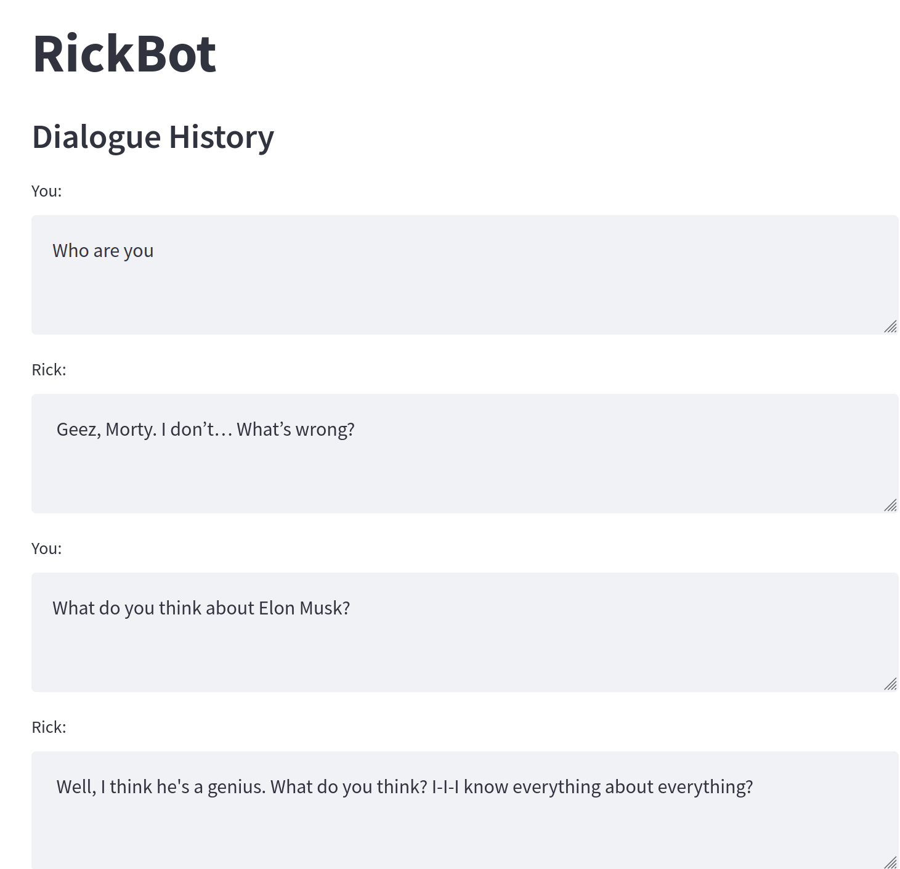
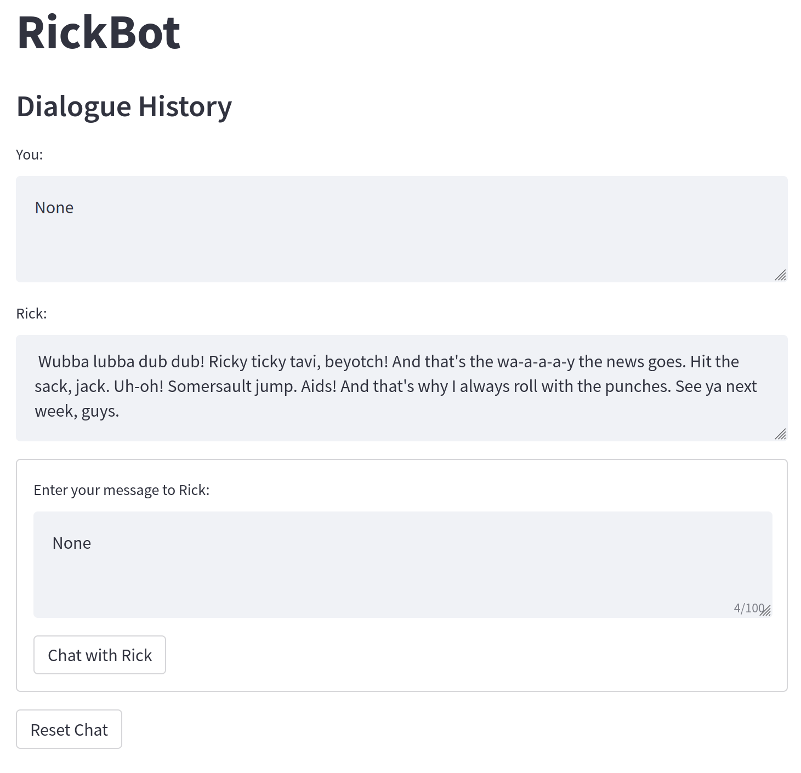

## about 

- finetune GPT2 using Huggingface model 
- app https://gpt2-rickbot.streamlit.app/

## results 

- model https://huggingface.co/code-cp/gpt2-rickbot

- dialogue bot 




- after 1 epoch 

```
sample 0: Rick: I turned myself into a pickle, Morty!
Morty:  oh. *wetly*
Rick:  you know, in the world of Rick this world was so important.  I just didn't have anything to lose. *laugh*
Morty:  ok,
Setting `pad_token_id` to `eos_token_id`:50256 for open-end generation.
sample 1: Rick: I turned myself into a pickle, Morty!
Morty:  W-why on earth did you do it?
(The doors open to reveal a door through which a man standing in the street stands inside.)
Rick:  Huh! That's just not happening here, Morty. (
Setting `pad_token_id` to `eos_token_id`:50256 for open-end generation.
sample 2: Rick: I turned myself into a pickle, Morty!
Morty:  [singing] You know, you guys made a lot of noise.
Rick:  [singing] Oh, yeah.
Jerry:  [singing] Oh, hey, hey, hey, hey, hey
Setting `pad_token_id` to `eos_token_id`:50256 for open-end generation.
sample 3: Rick: I turned myself into a pickle, Morty!
Morty:  You should be able to call me Mortys, Morty. I’m always the one that's always trying to make fun of you.
(Morty stands up and turns into the pickle.)
Mort
```

- after 10 epoch 

```
sample 0: Rick: I turned myself into a pickle, Morty!
Morty:  Oh, geez, Rick. Did you ever come here with a gun?
Rick:  Sure.
Morty:  Uh, yeah.
Rick:  Yeah, huh Rick! I did it! Look
Setting `pad_token_id` to `eos_token_id`:50256 for open-end generation.
sample 1: Rick: I turned myself into a pickle, Morty!
Morty:  I'm just a dumb, weak, needy little human!
(Outside the church, everyone is dressed in robes and hats - all are dressed for church)
President:  All right, I'm the one who needs you
Setting `pad_token_id` to `eos_token_id`:50256 for open-end generation.
sample 2: Rick: I turned myself into a pickle, Morty!
Morty:  Oh, geez, Rick. I don't know what that means.
Rick:  Can you guys stop helping me with this, Morty? No, you can't. I’m just gonna do your best to
Setting `pad_token_id` to `eos_token_id`:50256 for open-end generation.
sample 3: Rick: I turned myself into a pickle, Morty!
Morty:  Whoa!
Rick:  Wait, wait, wait, wait. Listen to me, Morty.
Morty:  What?
Rick:  I'm sorry, Morty. I'm sorry.
Mort
```

```
sample 0: Rick: I turned myself into a pickle, Morty!
Morty:  Hey man, Rick, you really do have a pickle. W-w-w-what's going on?
Rick:  You know, just listen to me. I don't want to hear about anything bad happening
sample 1: Rick: I turned myself into a pickle, Morty!
Morty:  Ugh!
Rick:  Mm, thank you, Morty. Now do it, Morty!
Morty:  Uhh...
Rick:  [sighs]
Morty:  A
sample 2: Rick: I turned myself into a pickle, Morty!
Morty:  Wait, uh --
Rick:  Morty, you want to talk about the pickle?
Morty:  Oh, cool, Rick! I-I’m bored!
Rick:  Wait --

sample 3: Rick: I turned myself into a pickle, Morty!
Morty:  [ Clears throat ] I-I’m not picking the pockets, Rick! What is this supposed to be?
Rick:  Oh, what is this, a movie about picking pockets?
```
